# Use Case Diagram

Plant UML มีความสามารถในการรองรับการเขียน use case diagram ทั้งในส่วนของ use case, actor, การเปลี่ยนลูกศรเป็นแบบต่างๆ  

Reference : [https://plantuml.com/use-case-diagram](https://plantuml.com/use-case-diagram)

## แนะนำการเขียน use case โดยใช้ plantuml

---

### 1. Use cases

การเขียน use case ทำได้โดยการเขียนชื่อ use case ไว้ในวงเล็บ ( ) ซึ่งถ้าดูรูปจะคล้ายกับรูปวงรี
นอกจากการใช้วงเล็บ อาจจะเขียนคีย์เวิร์ด `usecase` นำหน้าชื่อ use case ที่ต้องการ

``` text
@startuml diagram1
' ระบุ use case โดยใช้เครื่องหมายวงเล็บ
(First usecase)  

' ระบุ use case โดยใช้เครื่องหมายวงเล็บ และกำหนดชื่อให้เป็น UC2  
' ในการอ้างถึงในด้านล่างของโปรแกรม เราสามารถใช้ได้ทั้งชื่อ use case และชื่อตัวแปร
(Another usecase) as (UC2)

' สร้าง use case ชื่อ UC3 โดยใชีคีย์เวิร์ด (ไม่ใช้วงเล็บ)  
usecase UC3

' สร้าง use case ที่มีข้อความ 2 บรรทัด และกำหนดชื่อตัวแปรเป็น UC4
usecase (Last\nusecase) as UC4
@enduml
```

จาก code ด้านบนจะถูกวาดเป็นไดอะแกรมตามรูปที่ 1


รูปที่ 1 การวาด use case

---

### 2. Actors

* การเขียน actor ทำได้โดยการเขียนคร่อมด้วนเครื่องหมาย colon ทั้งสองด้าน
* หรือเขียนตามหลังคีย์เวิร์ด actor ก็ได้
* เราสามารถกำหนดชื่อตัวแปรให้กับ actor  เพื่อความสะดวกในการเรียกใช้งานในภายหลัง โดยใช้คีย์เวิร์ด as  

```text
@startuml diagram2
' เขียน actor โดยวิธีการปกติ (ล้อมรอบด้วย colon :___: )
:First Actor:

' เขียน actor โดยวิธีการปกติ พร้อมกำหนดชื่อตัวแปร
:Another\nactor: as Men2

' เขียน actor โดยใช้คีย์เวิร์ด actor
actor Men3

' เขียน actor โดยวิธีการปกติ พร้อมกำหนดชื่อตัวแปร
actor :Last actor: as Men4
```

จาก code ด้านบนจะถูกวาดเป็นไดอะแกรมตามรูปที่ 2

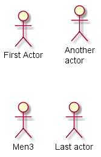

รูปที่ 2 การวาด actor

---

### 3. Usecases description

* ถ้าชื่อ use case มีข้อความที่ยาวหลายบรรทัด  
* เราสามารถเขียนล้อมรอบด้วยเครื่องหมายคำพูด ("  ")  
* สามารถใช้เครื่องหมายต่อไปนี้เพื่อแบ่งส่วนย่อย (separator) ของ use case  
  * --
  * ..
  * ==
  * __
* สามารถใส่  title ในตัวแบ่งส่วนได้

พิจารณาจากตัวอย่างต่อไปนี้

``` text
@startuml diagram3
usecase UC1 as "You can use
several lines to define your usecase.
You can also use separators.
--
Several separators are possible.
==
And you can add titles:
..Conclusion..
This allows large description."

@enduml
```

จาก code ด้านบนจะถูกวาดเป็นไดอะแกรมตามรูปที่ 3


รูปที่ 3 การเขียน Usecases description

### 4. Extension

Actor หรือ use case สามารถทำ inheritance ได้
เราสามารถใช้เครื่องหมาย  <|-- เพื่อแสดง inheritance  

``` text
@startuml diagram4
:Main Admin: as Admin
(Use the application) as (Use)

User <|-- Admin
(Start) <|-- (Use)

@enduml
```

จาก code ด้านบนจะถูกวาดเป็นไดอะแกรมตามรูปที่ 4

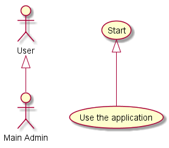

รูปที่ 4 การเขียน Extension

---

### 5. notes

ใน plantuml เราสามารถเขียน note เพื่ออธิบายส่วนประกอบต่างๆ หรือให้ข้อมูลเพิ่มเติมแก่ผู้ใช้งาน use case diagram ได้  

โดยที่ note สามารถเขียนไว้ที่ด้านซ้าย ขวา บน หรือ ล่าง ขององค์ประกอบอื่นๆ หรือเขียนไว้ต่างหาก แล้วเชื่อมไปยังองค์ประกอบที่ต้องการ โดยใช้เครื่องหมาย ..

``` text
@startuml diagram5
:Main Admin: as Admin
(Use the application) as (Use)

User -> (Start)
User --> (Use)

Admin ---> (Use)

note right of Admin : This is an example.

note right of (Use)
  A note can also
  be on several lines
end note

note "This note is connected\nto several objects." as N2
(Start) .. N2
N2 .. (Use)
@enduml

```

จาก code ด้านบนจะถูกวาดเป็นไดอะแกรมตามรูปที่ 5

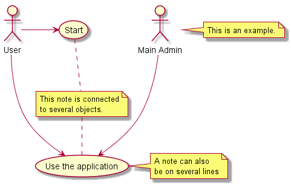

รูปที่ 5 การเขียน notes

---

## 6. Stereotypes

ใน use case diagram เราสามารถใช้ stereo type ในขณะที่กำหนด actor หรือ usecase  โดยใช้เครื่องหมาย << และ >>  ล้อมรอบข้อความ

``` text
@startuml diagram6
User << Human >>
:Main Database: as MySql << Application >>
(Start) << One Shot >>
(Use the application) as (Use) << Main >>

User -> (Start)
User --> (Use)

MySql --> (Use)

@enduml
```

จาก code ด้านบนจะถูกวาดเป็นไดอะแกรมตามรูปที่ 6

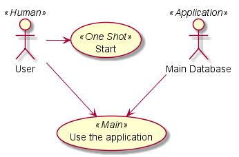

รูปที่ 6 การเขียน Stereotypes

---

## 7. การกำหนดทิศทางหัวลูกศร

การกำหนดทิศทางหัวลูกศรทำได้หลายวิธี เช่น การกำหนดโดยใช้สัญลักษณ์ต่างๆ และการกำหนดโดยระบุทิศทางที่ต้องการลงไปในเส้นลูกศร 

โดยปกติ การกำหนดทิศทางทำได้โดยการใช้เครื่องหมายต่อไปนี้

|สัญลักษณ์| ทิศทาง|
|--------|------|
| `-->`  | ล่าง  |
| `->`   | ขวา  |
| `<--`  | บน   |
| `<-`   | ซ้าย  |

พิจารณาตัวอย่างโปรแกรมต่อไปนี้

``` text
@startuml diagram7-1

' down
:user1: --> (Use case 1)

' right
:user1: -> (Use case 2)

' up
(Use case 3) <.. :user2:

'left
(Use case 4) <- :user2:

@enduml

```

จาก code ด้านบนจะถูกวาดเป็นไดอะแกรมตามรูปที่ 7.1

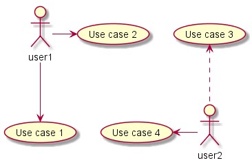

รูปที่ 7.1 การกำหนดทิศทางหัวลูกศรโดยการใช้สัญลักษณ์

ถ้าต้องการระบุทิศทางที่ชัดแจ้งลงไป ก็สามารถทำได้ดังนี้

|   สัญลักษณ์ | ทิศทาง|
|------------|------|
| `-down->`  | ล่าง  |
| `-right->` | ขวา  |
| `-up->`    | บน   |
| `-left->`  | ซ้าย  |

พิจารณาตัวอย่างต่อไปนี้

``` text
@startuml diagram7-2

:user: -left-> (dummyLeft)
:user: -right-> (dummyRight)
:user: -up-> (dummyUp)
:user: -down-> (dummyDown)

@enduml
```

จาก code ด้านบนจะถูกวาดเป็นไดอะแกรมตามรูปที่ 7.2

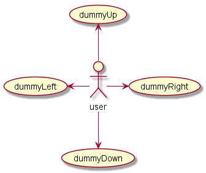

รูปที่ 7.2 การกำหนดทิศทางหัวลูกศรโดยการใช้สัญลักษณ์

---

## 8. การแยก use case diagram เป็นหลายหน้า

ในการเขียนไดอะแกรมที่มีความยาวมากๆ เราอาจจะใส่คีย์เวิร์ด newpage เพื่อกำหนดให้ plantuml ทำการแยกไดอะแกรมให้ ซึ่งเมื่อใส่คีย์เวิร์ด newpage แล้ว จะพบว่ามีภาพที่ถูกสร้างขึ้นเท่ากับจำนวนหน้า โดยที่ใช้ชื่อเดียวกันแต่มีเลขลำดับต่อท้ายชื่อไฟล์

พิจารณาตัวอย่างต่อไปนี้

``` text
@startuml diagram8
:actor1: --> (Usecase1)
newpage
:actor2: --> (Usecase2)
@enduml

```
ตัวอย่างด้านบน ถูกตั้งชื่อไฟล์ว่า  diagram8.puml ดังนั้น plantuml จะสร้างเป็นไฟล์ภาพ 2 ไฟล์ด้วยกัน โดยให้ชื่อไดอะแกรมแรกคือ diagram8.png และภาพที่ 2 ชื่อว่า diagram8_001.png ถ้ามีหลายหน้า ก็จะสร้างเป็น diagram8_002.png, diagram8_003.png ไปเป็นลำดับ


จาก code ด้านบนจะถูกวาดเป็นไดอะแกรมตามรูปที่ 8.1 และ 8.2 

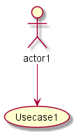

รูปที่ 8.1 การกำหนดทิศทางหัวลูกศรโดยการใช้สัญลักษณ์

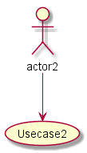

รูปที่ 8.2 การกำหนดทิศทางหัวลูกศรโดยการใช้สัญลักษณ์

---

## 9. การกำหนดทิศทางเริ่มต้น ให้เรียงจากซ้ายไปขวา

โดยปกติ  plantuml จะวาดภาพเรียงจากบนลงล่าง แต่เราก็สามารถปรับเปลี่ยนพฤติกรรมนั้นได้โดยการใช้คำสั่ง left to right direction

พิจารณาตัวอย่างต่่อไปนี้ 

#### 9.1 กรณีปกติ (ไม่ใช้ left to right direction)

``` text
@startuml

' default
' top to bottom direction
user1 --> (Usecase 1)
user2 --> (Usecase 2)

@enduml

```

จาก code ด้านบนจะถูกวาดเป็นไดอะแกรมตามรูปที่ 9.1

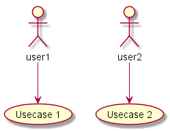

รูปที่ 9.1 ทิศทางการวาดปกติจากบนลงล่าง

#### 9.2 กรณีใช้ left to right direction  

``` text
@startuml

left to right direction
user1 --> (Usecase 1)
user2 --> (Usecase 2)

@enduml

```

จาก code ด้านบนจะถูกวาดเป็นไดอะแกรมตามรูปที่ 9.2

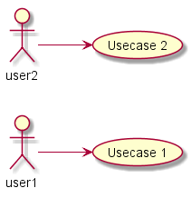

รูปที่ 9.2 ทิศทางการวาดปกติจากบนลงล่าง

----

## 10. การใช้งาน skin  

plantuml รองรับการใช้งาน skin เพื่อเปลี่ยนรูปแบบในการวาดให้มีความน่าสนใจ พิจารณาตัวอย่างต่อไปนี้

```text
@startuml
skinparam handwritten true

skinparam usecase {
BackgroundColor DarkSeaGreen
BorderColor DarkSlateGray

BackgroundColor<< Main >> YellowGreen
BorderColor<< Main >> YellowGreen

ArrowColor Olive
ActorBorderColor black
ActorFontName Courier

ActorBackgroundColor<< Human >> Gold
}

User << Human >>
:Main Database: as MySql << Application >>
(Start) << One Shot >>
(Use the application) as (Use) << Main >>

User -> (Start)
User --> (Use)

MySql --> (Use)

@enduml

```

จาก code ด้านบนจะถูกวาดเป็นไดอะแกรมตามรูปที่ 10

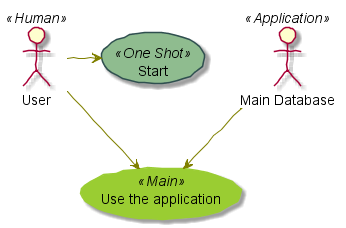

รูปที่ 10 ทิศทางการวาดปกติจากบนลงล่าง
